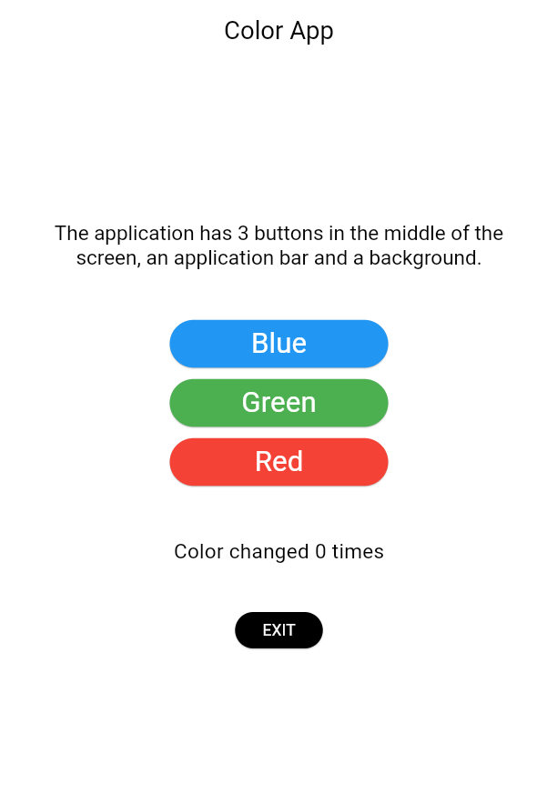
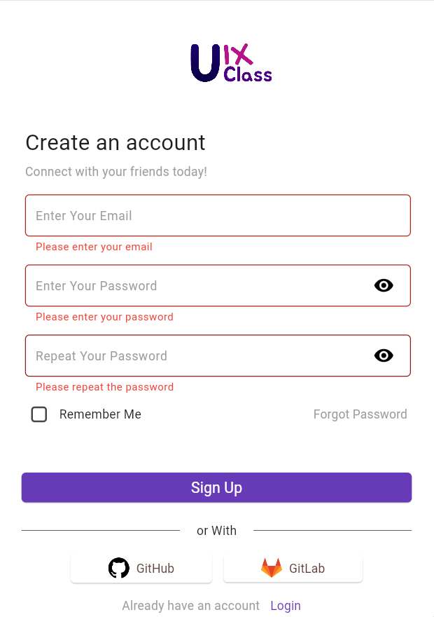
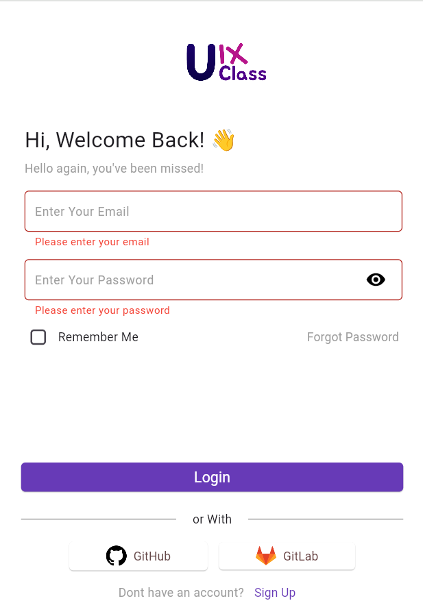

# Color App

1. Implemented Auth UI according to Figma
2. Covered Auth Form with validation
3. Implemented logic for changing colors depending on user's actions
4. Added logic for saving user's data in local storage and restoring on app restart
5. Used local storage in order to handle multiaccount 
6. Implemented localisation 
7. Refactored models with Freezed library in order to optimise data handling
8. Added animation for color changing
9. Added Splash screen and app icon
10. Used Chrome Dev tool for debugging app logic in Web
11. Covered app logic with Unit tests
12. Used Github to cooperate with team
13. Used Jira to plan and track tasks
14. Worked within Sprints
15. Estimated tasks according to Agile methodologies 
16. Used Secure storage and password hashing to improve app security
17. Used interfaces in order to handle multiple data sources
18. Refactored application using layered architecture to improve modularity

 # Screenshots

